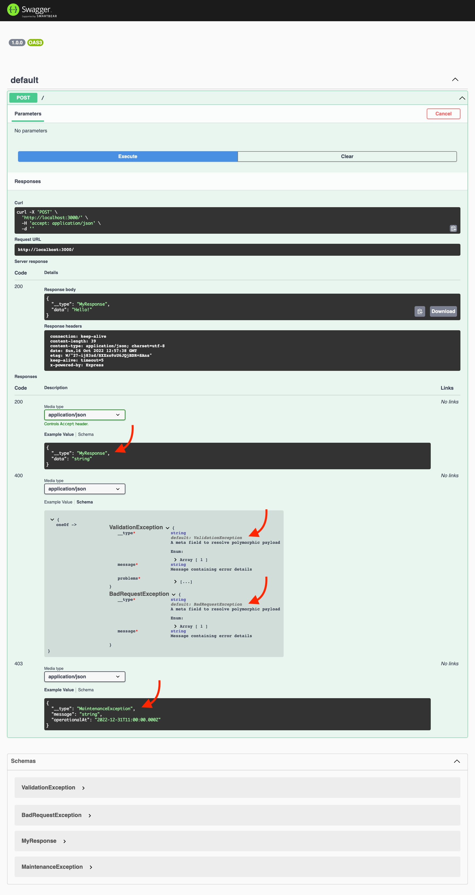

nestjs-typed-responses / [Exports](modules.md)

# [Handle polymorphic responses](https://swagger.io/docs/specification/data-models/inheritance-and-polymorphism) in Nest.js OpenAPI

Enables OpenAPI v3 polymorphism using `__type` metafield to resolve different exceptions or responses within the same HTTP code response group.

[](https://www.npmjs.com/nestjs-typed-responses)
[](https://codecov.io/gh/igrek8/nestjs-typed-responses)


## Installation

```bash
npm install --save nestjs-typed-responses

yarn add nestjs-typed-responses
```

## OpenAPI



## Usage

```ts
import { ConsoleLogger, Controller, HttpCode, HttpStatus, Module, Post, ValidationPipe } from '@nestjs/common';
import { APP_PIPE, NestFactory } from '@nestjs/core';
import {
  ApiBadRequestResponse,
  ApiExtraModels,
  ApiForbiddenResponse,
  ApiOkResponse,
  ApiProperty,
  DocumentBuilder,
  refs,
  SwaggerModule,
} from '@nestjs/swagger';
import { Expose } from 'class-transformer';
import { IsDateString, IsString } from 'class-validator';
import {
  ApiTypeMetafield,
  BadRequestException,
  ServiceUnavailableException,
  TypedDataTransferObject,
  TypedResponseModule,
  ValidationException,
} from 'nestjs-typed-responses';

class MyResponse implements TypedDataTransferObject {
  // ApiTypeMetafield must be defined to specify serializable type
  @ApiTypeMetafield('MyResponse')
  __type = 'MyResponse';

  // It is not required to apply @Expose decorator (per configuration)
  @ApiProperty()
  @IsString()
  data!: string;

  constructor(props: Omit<MyResponse, '__type'>) {
    Object.assign(this, props);
  }
}

class MaintenanceException extends ServiceUnavailableException implements TypedDataTransferObject {
  // ApiTypeMetafield must be defined to specify serializable type
  @ApiTypeMetafield('MaintenanceException')
  override __type = 'MaintenanceException';

  // @Expose must be used explicitly in error classes as only such fields will be exposed
  @Expose()
  @ApiProperty({
    example: '2022-12-31T11:00:00.000Z',
    description: 'There is a maintenance on the server',
  })
  @IsDateString()
  operationalAt!: Date;
}

@Controller()
@ApiExtraModels(ValidationException, BadRequestException)
class AppController {
  @Post()
  @HttpCode(HttpStatus.OK)
  @ApiOkResponse({ type: MyResponse })
  @ApiForbiddenResponse({ type: MaintenanceException })
  // Polymorphism https://swagger.io/docs/specification/data-models/inheritance-and-polymorphism/
  @ApiBadRequestResponse({ schema: { oneOf: refs(ValidationException, BadRequestException) } })
  demo(): MyResponse {
    return new MyResponse({
      data: 'Hello!',
    });
  }
}

@Module({
  providers: [
    {
      provide: APP_PIPE,
      useValue: new ValidationPipe({
        exceptionFactory: ValidationException.exceptionFactory,
      }),
    },
  ],
  imports: [
    TypedResponseModule.registerAsync({
      inject: ['APP_LOGGER'],
      provideInjectionTokensFrom: [
        {
          provide: 'APP_LOGGER',
          useClass: ConsoleLogger,
        },
      ],
      useFactory: () => ({}),
    }),
  ],
  controllers: [AppController],
})
class AppModule {}

async function bootstrap() {
  const app = await NestFactory.create(AppModule);
  const config = new DocumentBuilder().build();
  const document = SwaggerModule.createDocument(app, config);
  SwaggerModule.setup('/', app, document);
  await app.listen(3000);
}
bootstrap();
```
